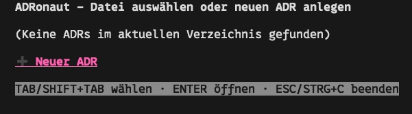
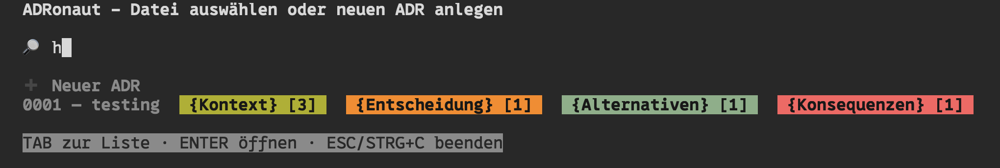

# ADRonaut

<p align="center">
  
</p>

ADRonaut ist ein leistungsstarkes[(!)](https://de.wikipedia.org/wiki/Sic) Terminal-Tool, welches dir dabei hilft, Architecture Decision Records (ADRs) schnell und effizient zu erstellen und zu bearbeiten.

Es unterstützt dich nicht nur beim Verfassen und Editieren deiner ADRs, sondern speichert automatisch den aktuellen Bearbeitungsstand jeder noch nicht finalisierten Entscheidung als Savestate.

Beim nächsten Start zeigt dir ADRonaut diese offenen Entwürfe direkt im Menü an, so kannst du nahtlos dort weitermachen, wo du zuletzt aufgehört hast.

ADRonaut listet außerdem alle Markdown-ADRs im Startverzeichnis auf, sodass du sie bequem nachbearbeiten kannst – zum Beispiel, um den Status anzupassen.

## Benutzung

ADRonaut ist intuitiv bedienbar und führt dich Schritt für Schritt durch alle Menüs.
Am unteren Rand erhältst du jederzeit hilfreiche Hinweise zur Navigation:


Darüber hinaus bietet ADRonaut eine klare, im Gruvbox-Stil gehaltene Suchfunktion, 
mit der du vorhandene ADRs schnell findest und durchstöbern kannst:


### Installation

Ein Makefile wurde erstellt, um die Installation zu erleichtern. Voraussetzung ist, dass Go (Golang) bereits installiert ist.
Das Binary wird standardmäßig in `$HOME/.local/bin` abgelegt. 
Damit das Tool aufgerufen werden kann, muss dieser Pfad in deiner `$PATH`-Umgebungsvariable enthalten sein.
Starte `ADRonaut` anschließend einfach in dem Verzeichnis, in dem sich deine ADRs befinden.

Voraussetzung: Go 1.21+  
```bash
make install
```

### Deinstallation:

```
make clean
```

# Lizenz

MIT

